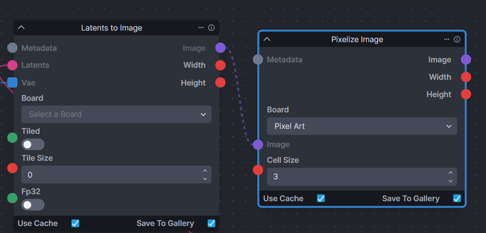

# pixelize
an Invoke node for pixel art

this node is dedicated to the ghost of Jacoby Bebo who some say still haunts El Pollo Loco!

This is an implementation of https://github.com/WuZongWei6/Pixelization 

# Installation
`git clone` this repo into the nodes folder in your InvokeAI folder. Then, inside the new pixelize folder, make a 'models' folder, and place the following 3 files into it:

- 160_net_G_A.pth
- alias_net.pth
- pixelart_vgg19.pth

These can be found at the original github link above (they are Google Drive links), and there's also a link to all 3 models in one archive at this similar [A1111 implementation](https://github.com/AUTOMATIC1111/stable-diffusion-webui-pixelization) repo.

# Usage

This node accepts an image input - the above example shows how to save a 'copy' of a generated image to a new 'Pixel Art' Board.

**Cell Size** - this setting controls how large the pixels are; in other words, how much the image is downscaled perceptually. A cell size of 2 works well for smaller SD 1.5 images, and 3-4 is better for larger SDXL images.

# Notes

Apologies, but the original implementation only works on CUDA devices. I'm working on changing this, but am not done yet. Also, the models required do not have the same license as this code, so please double check the original implementation repo when downloading them.
